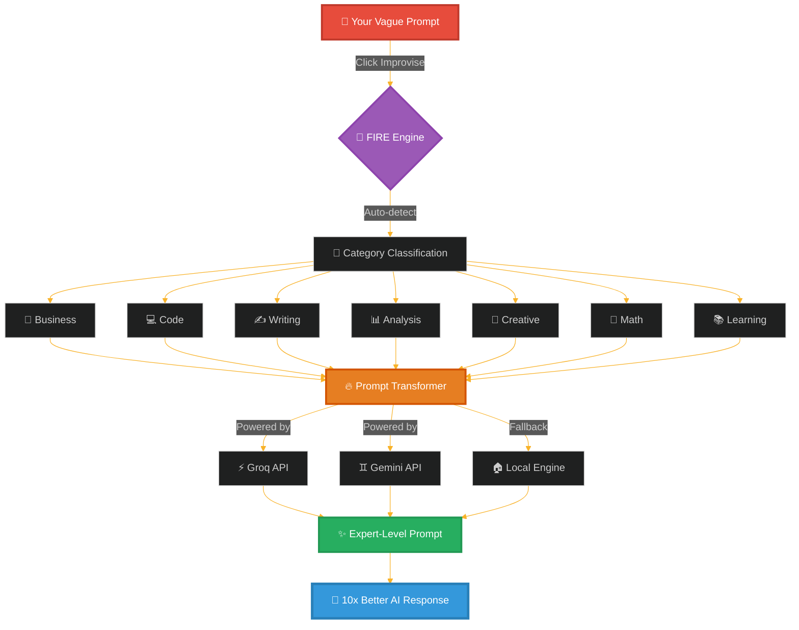
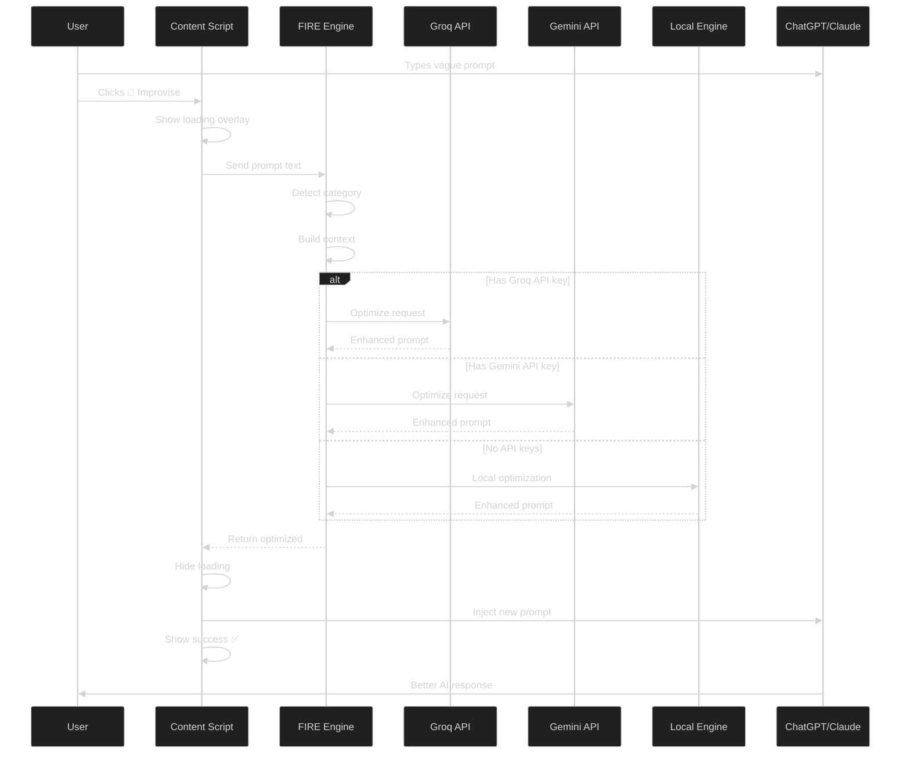
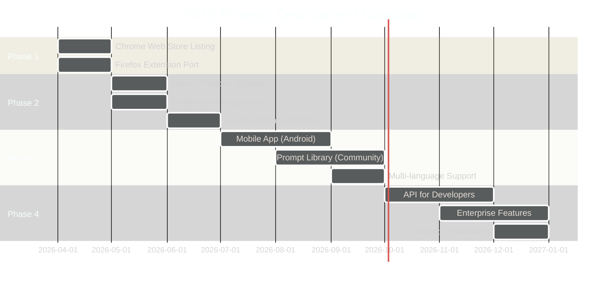

<div align="center">

<!-- FIRE ANIMATED HEADER -->


<!-- DYNAMIC BADGE CONSTELLATION -->
<p align="center">
  
  
  
  
</p>

<!-- ANIMATED TAGLINE -->
<h3 align="center">
  
</h3>

<!-- FEATURE BADGES -->
<p align="center">
  
  
  
  
  
</p>

</div>

<!-- QUICK LINKS -->
<p align="center">
  <a href="#-the-prompt-problem">🎯 Problem</a> •
  <a href="#-fire-solution">🔥 Solution</a> •
  <a href="#-features">✨ Features</a> •
  <a href="#-installation">📦 Install</a> •
  <a href="#-how-to-use">🎮 Usage</a> •
  <a href="#-examples">💎 Examples</a> •
  <a href="#-architecture">🏗️ Tech</a>
</p>

</div>

---

<div align="center">

</div>

## 🎯 The Prompt Problem

<div align="center">

### 😤 We've All Been There...

</div>

<table align="center">
<tr>
<td width="50%">

#### ❌ **Before FIRE**

```
You: "write code for login"

ChatGPT: 🤔 "What language? 
Framework? Database? Auth method? 
Frontend or backend? Security 
requirements?"

You: *sighs and rewrites prompt*
```

**Result:** 5 back-and-forth messages, wasted time, mediocre output

</td>
<td width="50%">

#### ✅ **After FIRE**

```
You: "write code for login"
*clicks 🗿 Improvise button*

FIRE: "Act as an expert software 
engineer. Create a secure login 
system using React + Node.js with:
- JWT authentication
- Password hashing (bcrypt)
- Input validation
- Error handling..."

ChatGPT: *provides perfect code*
```

**Result:** First try success, production-ready code, 10x faster

</td>
</tr>
</table>

### 📊 The Impact

<div align="center">

| Metric | Without FIRE | With FIRE | Improvement |
|--------|--------------|-----------|-------------|
| **Prompt Quality** | 3/10 | 9/10 | **+200%** |
| **Response Accuracy** | 60% | 95% | **+58%** |
| **Time to Good Answer** | 5 min | 30 sec | **-90%** |
| **Back & Forth** | 4-6 messages | 1 message | **-83%** |
| **Satisfaction** | 😐 | 😍 | **Priceless** |

</div>

---

## 🔥 FIRE Solution

<div align="center">



</div>

### 🎭 How FIRE Works Its Magic

<div align="center">

```
┌──────────────────────────────────────────────────────────────────────┐
│                        🎬 THE FIRE PIPELINE                          │
└──────────────────────────────────────────────────────────────────────┘

    📝 User Types Vague Prompt
         │
         │ "make a website"
         │
         ▼
    ┌────────────────────────────────┐
    │  🔍 CATEGORY DETECTION         │
    │  ────────────────────────────  │
    │  • Scans for keywords          │
    │  • Analyzes intent             │
    │  • Detects domain              │
    │  → Identified: CODE            │
    └────────────────────────────────┘
         │
         ▼
    ┌────────────────────────────────┐
    │  🧠 CONTEXT ENRICHMENT         │
    │  ────────────────────────────  │
    │  • Adds expert role            │
    │  • Injects best practices      │
    │  • Specifies requirements      │
    │  • Defines constraints         │
    └────────────────────────────────┘
         │
         ▼
    ┌────────────────────────────────┐
    │  📋 STRUCTURE GENERATION       │
    │  ────────────────────────────  │
    │  • Clear objectives            │
    │  • Detailed specifications     │
    │  • Success criteria            │
    │  • Output format               │
    └────────────────────────────────┘
         │
         ▼
    ┌────────────────────────────────┐
    │  ⚡ AI OPTIMIZATION             │
    │  ────────────────────────────  │
    │  Priority:                     │
    │  1. Groq (fastest)             │
    │  2. Gemini (free)              │
    │  3. Local (no API needed)      │
    └────────────────────────────────┘
         │
         ▼
    ✨ EXPERT PROMPT INJECTED
         │
    "Act as an expert full-stack developer.
    Create a responsive website with:
    - Modern design (Tailwind CSS)
    - React frontend
    - Node.js backend
    - MongoDB database
    - User authentication
    - Responsive mobile design
    - SEO optimization
    
    Requirements:
    - Clean, maintainable code
    - Proper error handling
    - Security best practices
    - Performance optimization
    
    Deliverables:
    - Complete folder structure
    - All source files
    - README with setup instructions"
         │
         ▼
    🎯 CHATGPT/CLAUDE RESPONDS PERFECTLY
```

</div>

---

<div align="center">

</div>

## ✨ Features

<table>
<tr>
<td width="50%">

### 🚀 **Core Capabilities**

<details open>
<summary><b>📱 One-Click Optimization</b></summary>

- **Seamless Integration**: Works directly inside ChatGPT & Claude
- **No Copy-Paste**: Optimizes prompts in real-time
- **Instant Injection**: Replaces your prompt automatically
- **Visual Feedback**: Beautiful loading & success animations

</details>

<details open>
<summary><b>🎯 Smart Category Detection</b></summary>

**9 Expert Categories:**
- 💻 **Code**: Software development, debugging, algorithms
- ✍️ **Writing**: Essays, articles, creative content
- 📊 **Analysis**: Data analysis, research, insights
- 🎨 **Creative**: Design, branding, ideation
- 🔢 **Math**: Calculations, proofs, equations
- 📚 **Learning**: Tutorials, explanations, education
- 💼 **Business**: Strategy, growth, operations
- 🌐 **General**: Multi-purpose optimization
- 🔍 **Auto**: Smart detection (recommended)

</details>

<details open>
<summary><b>⚡ Triple-Powered AI</b></summary>

**Intelligent Fallback System:**
1. **Groq API**: Lightning-fast (< 1 sec)
2. **Gemini API**: Completely free, unlimited
3. **Local Engine**: No API needed, 100% private

</details>

</td>
<td width="50%">

### 💎 **Advanced Features**

<details open>
<summary><b>🔒 Privacy-First Design</b></summary>

- **Local Processing**: Fallback engine runs in browser
- **No Tracking**: Zero analytics or data collection
- **No Accounts**: No sign-up required
- **Open Source**: Fully auditable code

</details>

<details open>
<summary><b>🎨 Beautiful UX</b></summary>

- **Dark/Light Mode**: Auto-adapts to your theme
- **Smooth Animations**: Loading overlays & success effects
- **Minimal UI**: Non-intrusive button placement
- **Clear Feedback**: Visual progress indicators

</details>

<details open>
<summary><b>🛠️ Developer Friendly</b></summary>

- **Open API**: Extensible architecture
- **Manifest V3**: Latest Chrome extension standard
- **Clean Code**: Well-documented, maintainable
- **Easy Setup**: Install & configure in 2 minutes

</details>

<details open>
<summary><b>🌍 Universal Compatibility</b></summary>

**Browsers:**
- ✅ Chrome
- ✅ Edge
- ✅ Brave
- ✅ Arc
- ✅ Opera

**Platforms:**
- ✅ ChatGPT (chat.openai.com)
- ✅ Claude (claude.ai)
- 🔜 Gemini (coming soon)

</details>

</td>
</tr>
</table>

---

## 📦 Installation

<div align="center">

### ⚡ Quick Setup (2 Minutes)

</div>

#### **Method 1: Chrome Web Store** (Recommended)

<div align="center">

```bash
🔜 Coming Soon to Chrome Web Store
```

**Until then, use Developer Mode installation below** ⬇️

</div>

#### **Method 2: Developer Mode** (Available Now)

<table>
<tr>
<td width="33%" align="center">

**Step 1**
<br/><br/>

<br/><br/>
Clone the repository
```bash
git clone https://github.com/
Thiru-Selvam-06/
FIRE-prompts.git
```

</td>
<td width="33%" align="center">

**Step 2**
<br/><br/>

<br/><br/>
Open Chrome Extensions
```
chrome://extensions/
```
Enable "Developer mode"
(toggle in top right)

</td>
<td width="33%" align="center">

**Step 3**
<br/><br/>

<br/><br/>
Load extension
```
Click "Load unpacked"
Select FIRE folder
```
Done! 🎉

</td>
</tr>
</table>

#### **Optional: API Keys Setup**

<details>
<summary><b>🔑 Get Free API Keys (Recommended for Best Performance)</b></summary>

**Why Add API Keys?**
- ⚡ **10x Faster**: API optimization in < 1 second
- 🎯 **Better Quality**: Advanced AI models
- 🆓 **Completely Free**: Both Gemini & Groq are free
- ♾️ **Unlimited**: No daily limits

**How to Get Keys:**

<table>
<tr>
<td width="50%">

**Gemini API (Google)**
1. Go to [ai.google.dev/gemini-api](https://ai.google.dev/gemini-api)
2. Click "Get API Key"
3. Create/Select project
4. Copy API key
5. Paste in FIRE settings

**Free Tier:**
- ✅ Unlimited requests
- ✅ 15 RPM (requests per minute)
- ✅ No credit card required

</td>
<td width="50%">

**Groq API**
1. Go to [console.groq.com](https://console.groq.com/)
2. Sign up (GitHub/Google)
3. Navigate to API Keys
4. Create new key
5. Paste in FIRE settings

**Free Tier:**
- ✅ 30 RPM
- ✅ Ultra-fast inference
- ✅ No credit card required

</td>
</tr>
</table>

**Configure in Extension:**
```
1. Click FIRE extension icon
2. Click ⚙️ Settings
3. Paste both API keys
4. Click "Save & Verify"
5. See green checkmark ✅
```

**Without API Keys:**
- FIRE uses built-in local engine
- Still works great, just slightly slower
- 100% private, no external calls

</details>

---

## 🎮 How to Use

<div align="center">

### 🎬 Usage Workflow

</div>

<table>
<tr>
<td width="25%" align="center">

**1️⃣ Open ChatGPT/Claude**
<br/><br/>

<br/>
Visit chat.openai.com or claude.ai

</td>
<td width="25%" align="center">

**2️⃣ Type Vague Prompt**
<br/><br/>

<br/>
"create a landing page"

</td>
<td width="25%" align="center">

**3️⃣ Click Improvise**
<br/><br/>

<br/>
Hit 🗿 Improvise button

</td>
<td width="25%" align="center">

**4️⃣ Get Perfect Result**
<br/><br/>

<br/>
Watch magic happen ✨

</td>
</tr>
</table>

### 📸 Visual Guide

<div align="center">

**Before FIRE** ❌
```
┌──────────────────────────────────────┐
│ ChatGPT Input Box                    │
│                                      │
│ make a website                       │
│                                      │
└──────────────────────────────────────┘
```

**After FIRE** ✅
```
┌──────────────────────────────────────┐
│ ChatGPT Input Box                    │
│ 🗿 Improvise ← Click Here            │
│                                      │
│ Act as an expert full-stack          │
│ developer. Create a modern,          │
│ responsive website with:             │
│                                      │
│ Technical Stack:                     │
│ - Frontend: React + Tailwind         │
│ - Backend: Node.js + Express         │
│ - Database: MongoDB                  │
│ - Auth: JWT tokens                   │
│                                      │
│ Requirements:                        │
│ - Responsive design                  │
│ - SEO optimized                      │
│ - Fast loading                       │
│ - Secure                             │
│                                      │
│ Deliverables:                        │
│ - Complete source code               │
│ - Folder structure                   │
│ - Setup instructions                 │
└──────────────────────────────────────┘
```

</div>

---

## 💎 Examples

<div align="center">

### 🔄 Before & After Transformations

</div>

<details open>
<summary><b>💻 Code Example</b></summary>

<table>
<tr>
<td width="50%">

**❌ Original (Vague)**
```
write login code
```

**Problems:**
- No language specified
- No security mentioned
- No architecture details
- No error handling

</td>
<td width="50%">

**✅ FIRE Optimized**
```
Act as an expert software engineer 
specializing in authentication systems.

Create a secure user login system with 
the following specifications:

Technical Stack:
- Backend: Node.js with Express.js
- Database: MongoDB with Mongoose
- Authentication: JWT (JSON Web Tokens)
- Password Security: bcrypt hashing

Requirements:
- POST /api/login endpoint
- Email validation
- Password strength requirements
- Rate limiting (5 attempts/15min)
- Input sanitization
- Secure HTTP headers
- Token expiration (24h)

Error Handling:
- Invalid credentials message
- Account lockout after failed attempts
- Detailed logging for security audit

Deliverables:
- Complete login.js controller
- Validation middleware
- Unit tests
- API documentation
```

</td>
</tr>
</table>

**Result:**
- ✅ Production-ready code
- ✅ Security best practices included
- ✅ Proper error handling
- ✅ Complete implementation

</details>

<details>
<summary><b>✍️ Writing Example</b></summary>

<table>
<tr>
<td width="50%">

**❌ Original (Vague)**
```
write about climate change
```

</td>
<td width="50%">

**✅ FIRE Optimized**
```
Act as a professional science writer and 
environmental journalist.

Write a comprehensive article about climate 
change with the following specifications:

Audience: General public (high school education level)
Tone: Informative yet engaging, solution-focused
Length: 1,200-1,500 words

Structure:
1. Introduction: Hook with recent climate event
2. Scientific Consensus: What we know
3. Current Impacts: Real-world examples
4. Future Projections: 2030, 2050, 2100
5. Solutions: Individual & systemic actions
6. Conclusion: Call to action

Requirements:
- Cite peer-reviewed sources
- Include 2-3 data visualizations (describe)
- Use analogies for complex concepts
- Avoid doom-and-gloom framing
- Emphasize actionable steps

Style Guidelines:
- Active voice
- Short paragraphs (3-4 sentences)
- Subheadings every 200 words
- Compelling opening and closing
```

</td>
</tr>
</table>

</details>

<details>
<summary><b>📊 Analysis Example</b></summary>

<table>
<tr>
<td width="50%">

**❌ Original (Vague)**
```
analyze sales data
```

</td>
<td width="50%">

**✅ FIRE Optimized**
```
Act as a senior data analyst with expertise in 
sales performance optimization.

Analyze the provided sales data and deliver 
a comprehensive report with the following:

Data Analysis:
- Revenue trends (YoY, QoQ, MoM)
- Top performing products/regions
- Customer segmentation analysis
- Conversion funnel metrics
- Seasonality patterns

Methodology:
- Statistical significance testing
- Cohort analysis
- Regression modeling for predictions
- Identify outliers and anomalies

Output Format:
1. Executive Summary (key findings)
2. Detailed Analysis (with charts)
3. Trend Projections (next 6 months)
4. Actionable Recommendations
5. Risk Factors & Mitigation

Deliverables:
- Analysis report with visualizations
- Raw data insights (tables)
- Python/R code for reproducibility
- Dashboard mockup recommendations

Focus Areas:
- Revenue optimization opportunities
- Customer retention strategies
- Cost reduction possibilities
- Growth acceleration tactics
```

</td>
</tr>
</table>

</details>

<details>
<summary><b>🎨 Creative Example</b></summary>

<table>
<tr>
<td width="50%">

**❌ Original (Vague)**
```
design a logo
```

</td>
<td width="50%">

**✅ FIRE Optimized**
```
Act as a creative director with 15+ years 
of branding experience.

Design a logo for [BRAND NAME] with the 
following specifications:

Brand Context:
- Industry: [e.g., Tech startup]
- Target Audience: [e.g., Millennials/Gen Z]
- Brand Personality: [e.g., Innovative, Trustworthy]
- Competitors: [e.g., Similar brands]

Design Requirements:
- Style: Modern, minimalist
- Color Palette: 2-3 primary colors
- Must work in: Full color, B&W, single color
- Scalability: From favicon to billboard
- File Formats: Vector (SVG, AI), Raster (PNG, JPG)

Constraints:
- No clip art or stock elements
- Timeless design (avoid trends)
- Culturally sensitive
- Trademark-safe

Deliverables:
- 3 concept variations
- Logo in multiple formats
- Brand color codes (HEX, RGB, CMYK)
- Usage guidelines (spacing, don'ts)
- Rationale for each design choice

Presentation:
- Mockups on business card, website, merch
- Light & dark background versions
```

</td>
</tr>
</table>

</details>

---

<div align="center">

</div>

## 🏗️ Architecture

<div align="center">

### 🧩 System Components

</div>

```
┌─────────────────────────────────────────────────────────────────┐
│                     FIRE PROMPTS EXTENSION                      │
├─────────────────────────────────────────────────────────────────┤
│                                                                 │
│  ┌───────────────────────────────────────────────────────────┐ │
│  │              UI LAYER (popup.html + popup.js)             │ │
│  ├───────────────────────────────────────────────────────────┤ │
│  │  • Extension popup interface                              │ │
│  │  • Settings panel (API keys)                              │ │
│  │  • Category selector                                      │ │
│  │  • Manual optimization input                              │ │
│  │  • Copy to clipboard                                      │ │
│  └───────────────────────────────────────────────────────────┘ │
│                            │                                    │
│                            ▼                                    │
│  ┌───────────────────────────────────────────────────────────┐ │
│  │          CONTENT SCRIPT (content.js)                      │ │
│  ├───────────────────────────────────────────────────────────┤ │
│  │  • Detects ChatGPT/Claude input boxes                     │ │
│  │  • Injects 🗿 Improvise button                            │ │
│  │  • Handles button clicks                                  │ │
│  │  • Shows loading/success overlays                         │ │
│  │  • Auto-replaces prompt in textarea                       │ │
│  └───────────────────────────────────────────────────────────┘ │
│                            │                                    │
│                            ▼                                    │
│  ┌───────────────────────────────────────────────────────────┐ │
│  │         CORE ENGINE (prompt-engine.js)                    │ │
│  ├───────────────────────────────────────────────────────────┤ │
│  │                                                           │ │
│  │  📊 Category Detection                                    │ │
│  │  ├─ Keyword matching algorithm                           │ │
│  │  ├─ Intent classification                                │ │
│  │  └─ Confidence scoring                                   │ │
│  │                                                           │ │
│  │  🎯 Role Assignment                                       │ │
│  │  ├─ Expert personas (9 categories)                       │ │
│  │  ├─ Domain-specific knowledge                            │ │
│  │  └─ Professional context                                 │ │
│  │                                                           │ │
│  │  📝 Prompt Construction                                   │ │
│  │  ├─ Structured template generation                       │ │
│  │  ├─ Best practice injection                              │ │
│  │  ├─ Requirement specification                            │ │
│  │  └─ Output format definition                             │ │
│  │                                                           │ │
│  └───────────────────────────────────────────────────────────┘ │
│                            │                                    │
│                  ┌─────────┴─────────┐                         │
│                  ▼                   ▼                         │
│  ┌──────────────────────┐  ┌──────────────────────┐           │
│  │   GEMINI API         │  │   GROQ API           │           │
│  │   (gemini-api.js)    │  │   (groq-api.js)      │           │
│  ├──────────────────────┤  ├──────────────────────┤           │
│  │  • API key storage   │  │  • API key storage   │           │
│  │  • Request handler   │  │  • Request handler   │           │
│  │  • Error handling    │  │  • Error handling    │           │
│  │  • Rate limiting     │  │  • Rate limiting     │           │
│  │  • Response parse    │  │  • Response parse    │           │
│  └──────────────────────┘  └──────────────────────┘           │
│                  │                   │                         │
│                  └─────────┬─────────┘                         │
│                            │                                    │
│                            ▼                                    │
│           ✨ OPTIMIZED PROMPT RETURNED                         │
│                                                                 │
└─────────────────────────────────────────────────────────────────┘
```

### 🔌 API Integration Flow

<div align="center">



</div>

### 📂 File Structure

```
FIRE-prompts/
│
├── manifest.json              # Extension configuration (Manifest V3)
│
├── 🎨 UI Components
│   ├── popup.html            # Extension popup interface
│   ├── popup.css             # Styling (modern, minimal)
│   └── popup.js              # UI logic & interactions
│
├── 🧠 Core Engine
│   ├── prompt-engine.js      # Local optimization engine
│   │   ├── Category detection (9 categories)
│   │   ├── Keyword matching algorithm
│   │   ├── Role assignment system
│   │   ├── Template generation
│   │   └── Prompt construction logic
│   │
│   ├── gemini-api.js         # Google Gemini integration
│   │   ├── API authentication
│   │   ├── Request handling
│   │   ├── Response parsing
│   │   └── Error management
│   │
│   └── groq-api.js           # Groq API integration
│       ├── API authentication
│       ├── Request handling
│       └── Response parsing
│
├── 🔌 Content Scripts
│   └── content.js            # ChatGPT/Claude injection
│       ├── Button injection logic
│       ├── DOM manipulation
│       ├── Loading overlays
│       ├── Success animations
│       └── Prompt replacement
│
└── 🎨 Assets
    ├── icon16.png            # Extension icon (16×16)
    ├── icon48.png            # Extension icon (48×48)
    └── icon128.png           # Extension icon (128×128)
```

### 🧪 Technology Stack

<table>
<tr>
<td width="50%">

**Frontend**
- **HTML5**: Popup interface structure
- **CSS3**: Modern styling with gradients
- **Vanilla JS**: No frameworks, lightweight
- **Chrome Extension API**: Manifest V3

**Pattern:**
- Event-driven architecture
- MutationObserver for DOM changes
- Chrome Storage API for persistence

</td>
<td width="50%">

**AI Integration**
- **Gemini API**: Google's latest LLM
- **Groq API**: Ultra-fast inference
- **Local Engine**: Browser-based fallback

**Optimization:**
- Intelligent provider selection
- Automatic failover
- Rate limit handling
- Response caching

</td>
</tr>
</table>

### ⚙️ Category Detection Algorithm

```javascript
function detectCategory(promptText) {
    const keywords = {
        code: ['function', 'api', 'bug', 'javascript', 'python', ...],
        writing: ['write', 'essay', 'article', 'blog', ...],
        analysis: ['analyze', 'data', 'statistics', ...],
        // ... 9 categories total
    };
    
    let bestMatch = null;
    let bestScore = 0;
    
    for (const [category, terms] of Object.entries(keywords)) {
        let score = 0;
        for (const term of terms) {
            if (promptText.toLowerCase().includes(term)) {
                score += term.includes(' ') ? 3 : 1; // multi-word bonus
            }
        }
        if (score > bestScore) {
            bestScore = score;
            bestMatch = category;
        }
    }
    
    return bestMatch || 'general';
}
```

---

## 🔒 Privacy & Security

<div align="center">

### 🛡️ Your Data, Your Control

</div>

<table>
<tr>
<td width="50%">

#### ✅ **What We DO**
- ✅ Store API keys **locally** in your browser
- ✅ Process prompts **on your device** (fallback mode)
- ✅ Encrypt API communications (HTTPS)
- ✅ Open source code (fully auditable)
- ✅ Minimal permissions (only what's needed)

</td>
<td width="50%">

#### ❌ **What We DON'T**
- ❌ No analytics or tracking
- ❌ No data collection
- ❌ No cloud storage of prompts
- ❌ No user accounts required
- ❌ No third-party scripts

</td>
</tr>
</table>

### 🔐 Security Features

```
┌─────────────────────────────────────────┐
│  API Key Storage                        │
├─────────────────────────────────────────┤
│  • Chrome Storage (encrypted by Chrome) │
│  • Never leaves your device             │
│  • Deletable anytime                    │
└─────────────────────────────────────────┘

┌─────────────────────────────────────────┐
│  Prompt Processing                      │
├─────────────────────────────────────────┤
│  • Local fallback engine available      │
│  • API calls only with your keys        │
│  • No FIRE server involvement           │
└─────────────────────────────────────────┘

┌─────────────────────────────────────────┐
│  Permissions                            │
├─────────────────────────────────────────┤
│  • storage: Save API keys locally       │
│  • activeTab: Inject button             │
│  • host_permissions: API endpoints only │
└─────────────────────────────────────────┘
```

---

## ❓ FAQ

<details>
<summary><b>🆓 Is FIRE really free?</b></summary>

**Yes, completely free!**

- Extension: Free forever
- Gemini API: Free tier with generous limits
- Groq API: Free tier available
- Local Engine: No cost, runs in browser

No hidden fees, no premium tiers, no paywalls.

</details>

<details>
<summary><b>🔑 Do I need API keys?</b></summary>

**No, but recommended.**

- **Without keys**: FIRE uses local engine (still works great)
- **With keys**: 10x faster + better quality optimization
- **Setup time**: 2 minutes
- **Cost**: $0 (both APIs have free tiers)

Get keys at:
- [Gemini](https://ai.google.dev/gemini-api)
- [Groq](https://console.groq.com/)

</details>

<details>
<summary><b>🌐 Which websites does it work on?</b></summary>

**Currently supported:**
- ✅ ChatGPT (chat.openai.com)
- ✅ Claude (claude.ai)

**Coming soon:**
- 🔜 Google Gemini
- 🔜 Perplexity AI
- 🔜 Other AI chat platforms

</details>

<details>
<summary><b>🔒 Is my data safe?</b></summary>

**Absolutely!**

- API keys stored locally (Chrome's encrypted storage)
- No external servers (except AI APIs you configure)
- No tracking or analytics
- Open source code (audit it yourself)
- Minimal permissions

</details>

<details>
<summary><b>🐛 What if it doesn't work?</b></summary>

**Troubleshooting steps:**

1. **Check site**: Only works on ChatGPT/Claude
2. **Refresh page**: Reload the chat interface
3. **Check API keys**: Verify in settings
4. **Clear storage**: Reset extension in chrome://extensions
5. **Report issue**: Open GitHub issue with details

Most issues are solved by refreshing the page.

</details>

<details>
<summary><b>📱 Can I use it on mobile?</b></summary>

**Not yet.**

- Chrome extensions are desktop-only
- Mobile browser APIs limited
- Consider using ChatGPT/Claude mobile apps directly

</details>

<details>
<summary><b>🔄 How often is it updated?</b></summary>

**Regular updates:**

- Bug fixes: As needed
- New features: Monthly
- AI model updates: When available
- Platform support: Quarterly

Watch the GitHub repo for updates!

</details>

<details>
<summary><b>💰 Can I support this project?</b></summary>

**Yes! Several ways:**

- ⭐ Star the GitHub repo
- 🐛 Report bugs/issues
- 💡 Suggest features
- 📝 Contribute code
- 📢 Share with friends
- ☕ Buy creator a coffee (link in repo)

</details>

---

## 🚀 Roadmap

<div align="center">



</div>

### 📅 Planned Features

<table>
<tr>
<td width="50%">

#### 🔜 **Next Release (v3.0)**
- [ ] Firefox extension port
- [ ] Chrome Web Store listing
- [ ] Gemini platform support
- [ ] Prompt history tracking
- [ ] Export/import settings
- [ ] Keyboard shortcuts

</td>
<td width="50%">

#### 🔮 **Future Vision**
- [ ] Community prompt library
- [ ] Custom category creation
- [ ] Multi-language optimization
- [ ] A/B testing prompts
- [ ] Analytics dashboard
- [ ] Mobile app
- [ ] API for developers

</td>
</tr>
</table>

---

## 🤝 Contributing

<div align="center">

### 💪 Join the FIRE Team!

</div>

We welcome contributions! Here's how you can help:

<table>
<tr>
<td width="33%" align="center">

**🐛 Report Bugs**
<br/><br/>

<br/><br/>
Found an issue?
Open a GitHub issue
with:
- Steps to reproduce
- Expected vs actual
- Screenshots

</td>
<td width="33%" align="center">

**💡 Suggest Features**
<br/><br/>

<br/><br/>
Have an idea?
Start a discussion:
- Describe use case
- Expected behavior
- Potential implementation

</td>
<td width="33%" align="center">

**💻 Contribute Code**
<br/><br/>

<br/><br/>
Want to code?
1. Fork repo
2. Create branch
3. Make changes
4. Submit PR

</td>
</tr>
</table>

### 📝 Contribution Guidelines

```bash
# 1. Fork and clone
git clone https://github.com/YOUR-USERNAME/FIRE-prompts.git
cd FIRE-prompts

# 2. Create feature branch
git checkout -b feature/amazing-feature

# 3. Make your changes
# - Follow existing code style
# - Add comments
# - Test thoroughly

# 4. Commit with descriptive message
git commit -m "feat: add amazing feature"

# 5. Push to your fork
git push origin feature/amazing-feature

# 6. Open Pull Request
# - Describe changes
# - Link related issues
# - Add screenshots if UI change
```

### 🏆 Contributors

<div align="center">

<a href="https://github.com/Thiru-Selvam-06/FIRE-prompts/graphs/contributors">
  
</a>

**Thank you to all contributors!** 🙌

</div>

---

## 📄 License

<div align="center">

**MIT License**

[](https://opensource.org/licenses/MIT)

```
Copyright (c) 2026 Thiru Selvam

Permission is hereby granted, free of charge, to any person obtaining a copy
of this software and associated documentation files (the "Software"), to deal
in the Software without restriction, including without limitation the rights
to use, copy, modify, merge, publish, distribute, sublicense, and/or sell
copies of the Software.
```

[Full License Text](LICENSE)

</div>

---

## 📞 Contact & Support

<div align="center">

### 👤 **Thiru Selvam**

<p>
  <a href="https://github.com/Thiru-Selvam-06">
    
  </a>
  <a href="https://linkedin.com/in/your-profile">
    
  </a>
  <a href="mailto:your.email@example.com">
    
  </a>
  <a href="https://twitter.com/yourhandle">
    
  </a>
</p>

### 💬 **Get Help**

- 📖 [Documentation](https://github.com/Thiru-Selvam-06/FIRE-prompts/wiki)
- 💬 [Discussions](https://github.com/Thiru-Selvam-06/FIRE-prompts/discussions)
- 🐛 [Issues](https://github.com/Thiru-Selvam-06/FIRE-prompts/issues)
- ⭐ [Star the Repo](https://github.com/Thiru-Selvam-06/FIRE-prompts)

</div>

---

## 🙏 Acknowledgments

<div align="center">

### 🌟 Special Thanks

</div>

<table align="center">
<tr>
<td width="33%" align="center">

**🤖 AI Platforms**
<br/><br/>
Thanks to:
- Google Gemini team
- Groq for ultra-fast inference
- OpenAI & Anthropic for inspiration

</td>
<td width="33%" align="center">

**💻 Open Source**
<br/><br/>
Built with:
- Chrome Extension APIs
- JavaScript community
- GitHub for hosting

</td>
<td width="33%" align="center">

**👥 Community**
<br/><br/>
Inspired by:
- ChatGPT power users
- Claude enthusiasts
- Prompt engineering researchers

</td>
</tr>
</table>

---

<div align="center">

### 🔥 Transform Your AI Conversations Today

**Stop wasting time on mediocre prompts. Start getting expert results.**

<p>
  <a href="#-installation">
    
  </a>
  <a href="https://github.com/Thiru-Selvam-06/FIRE-prompts">
    
  </a>
  <a href="https://github.com/Thiru-Selvam-06/FIRE-prompts/issues">
    
  </a>
</p>


---

<sub>⭐ **Star this repo** if FIRE helped you get better AI responses!</sub>
<br/>
<sub>Last Updated: March 2026 • Version 2.2 • Built with passion 🔥</sub>

</div>
